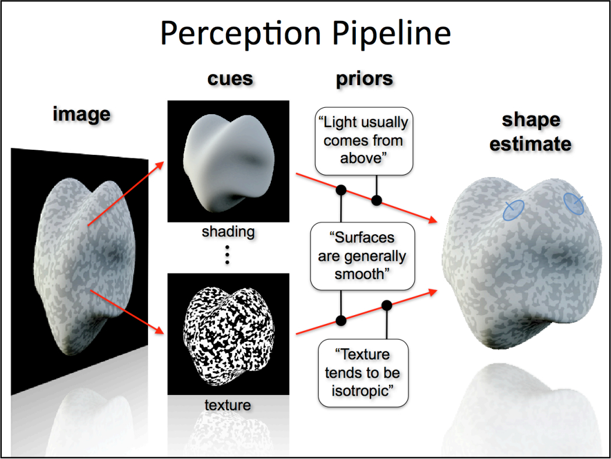

It takes me a long time to think about what is visual cue? how this works in shape perception?    
##Wikipedia
Actually, from wikipedia [Visual Cues](https://en.wikipedia.org/wiki/Sensory_cue#Visual_Cues), I find its Conception:    
>Visual cues are sensory cues received by the eye in the form of light and processed by the visual system during visual perception. Since the visual system is dominant in many species, especially humans, visual cues are a large source of information in how the world is perceived.    
Type of Cue: Depth, Motion, Biological Motion, Color, Contrast.
##What I think
At first I am confused visual cues with visual channels. Actually, they are different. Visual channels are used for visual encoding which serve as helping to store information [3D object aspect]. However, visual cues is just providing some tips to help human to perceive the shape which serves as help to get information, just as the brain extract some information to improve shape perception [eye aspect].

When I form the table(Hatching with Visual Cue: Shape, Shading, Depth) a few days ago. Why I made those column is that I made a summary of the NPR papers with line drawing, most related to hatching.    

In NPR, I find the visual cues they most refer are shading, depth, texture, shape. Here the texture is just texture pattern. If using hatching, it just refers to the different line drawing for hatching.

The below part is from my log:
>
1.In shading model, some people also involves the shading model parameters with four components, such as Lambertian shading, Specular shading, Ambient shading, Cast shadows
However,I find in Hatching what they use most are illumination, shadow, highlight.
2.Spatial cue of depth, I think distance from view is most widely used combined with light intensity, or other effect. occlusion and shading will also give depth cue, so here I add occlusion. Also we could merge those two column into one column.
3.For the Shape information, I think the orientation and boundary could give the shape cue, in addition, with the lighting effect will give much help to the perception of shape.
In fact, those visual cues have relationships with each other. It is hard to split them.    

- - - - - -
##Summary from the Siggraph tutorial
However, I really know I have something left, maybe I make some points wrong. So I spend a lot of time searching for a right classification. And I found this part of __Siggraph tutorial__ [
Visual perception of 3D shape](http://dl.acm.org/citation.cfm?id=1667263). It is very helpful, and I think I should make a conclusion for memory this stuff.

They focus on how the brain estimates and represents 3D shape? They also take the human vision and Psychologists ideal into account.
I think his Perception pipeline seems very good.    
    
It answers the perception process, from normal image to perceive the 3D shape, with the help of visual cues and priors.    
Because they focus on shape perception, so they mainly refer shape cues.
>The general ideal of extracting shape information from a given shape cue is sometimes referred to as getting “Shape from X”, where X could be shading, or texture, or binocular disparities or whatever.    

His types of cues are a bit like the wikipedia's. As different cues generally operate according to different physical laws with different brain stream to process it. At the begin of the PPT, they point out the __shape estimate__, which is some mental representation(shape representation) of the physical geometry of the object in the scene.
So what surface shape information or properties could be estimated or served for visual cues? and at the begin of the PPT, they refer some shape properties: orientation, geometry(curvature, position of points). also at the end og the PPT, they refer local surface properties, such as curvature, surface orientation or depth at different location.    
They also present how human perception works, and  the problem or ambiguities of 3D perception with the __Gestalt perception principle__.    
###Visual Cues
####1.Shading Cue   
* Importance of viewpoint(how we see the object)    
* How the light is set, where the light is from.
* Variation in geometry and illumination conditions.

* Isophotes
* Diffuse, Mirror(reflectance as illumination) surface with gradient direction to encode the information    
####2.Linear Perspective(a bit like Depth) Cue
Convergence of parallel line, use distance to encode depth information     
####3.Bounding Contours    
* Contours are a few line to capture the shape information.    
* Silhouette, suggestive contours(I add)
* Ridges and valleys (I add)    
* Apparent Ridges for creating contours for line drawings.(view-dependent curvature for line placement)    
####4.Motion cues      
>For non‐interactive conditions, in the absence of additional cues such as perspective or occlusion, there is a sign ambiguity associated with structure from motion.
####5.Texture (surface pattern) Cue       
Texture encodes information:      
   
* Compression of the texture: isotropic with different projection      
* Surface orientations (principle curvature, dominant gradient direction, dominant local orientation, align with feature lines)      
* Curvature (intrinsic curvature of the surface, Eigenvalues of the Hessian matrix)     

Texture with different orientation of the stripes.

###Visual Cues for hatching    
Compared with my table, I think his is much specialty. With right thing at right place, and the classification of visual cues based on the wikipedia. Maybe My classification should be modified. However, my classification is little well for providing some important imfortation first. 
__Should I chagee the table?__
